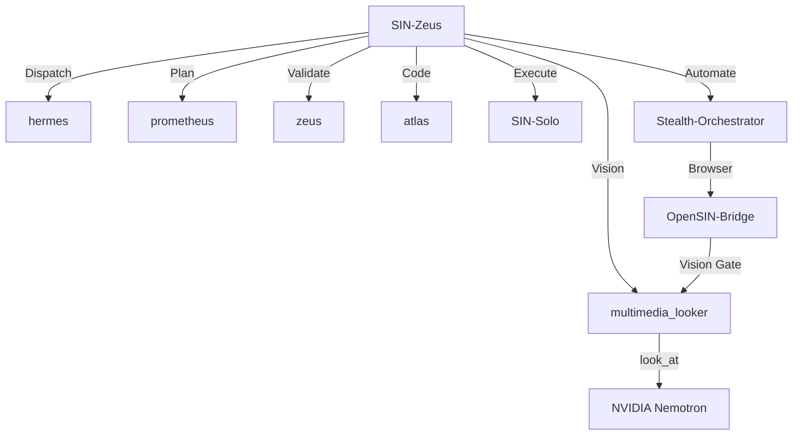
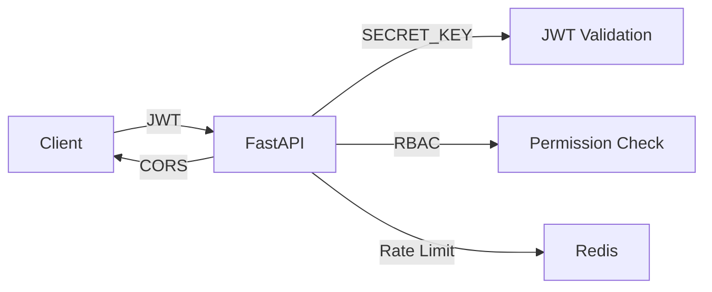
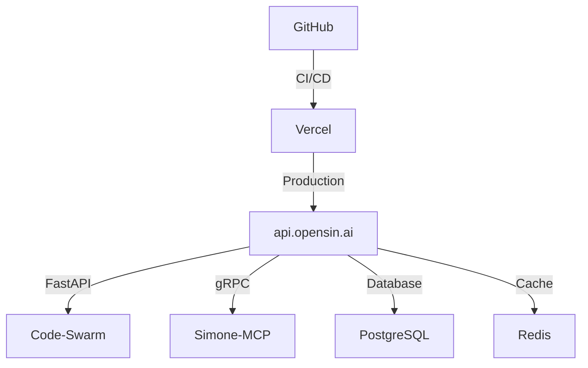

# Code-Swarm Architecture Guide

## 🏗️ System Architecture



## 🔧 Core Components

### 1. Agent System

| Agent | Model | Role | Provider |
|-------|-------|------|----------|
| SIN-Zeus | fireworks-ai/minimax-m2.7 | Fleet Commander | Fireworks AI |
| SIN-Solo | vercel/deepseek-v4-pro | Direct Executor | Vercel |
| coder-sin-swarm | fireworks-ai/minimax-m2.7 | Coder | Fireworks AI |
| multimedia_looker | nvidia/nvidia/nemotron-3-nano-omni | Vision | NVIDIA |

### 2. Infrastructure

```
OCI VM (ARM64)
├── FastAPI (Port 8000)
├── gRPC Server (Port 50051)
├── PostgreSQL (Data)
├── Redis (Cache)
├── Simone-MCP (AST Operations)
└── LangGraph (Orchestration)
```

### 3. Security Architecture



## 🛡️ Security Layers

| Layer | Implementation |
|-------|----------------|
| Authentication | JWT + OAuth2 |
| Authorization | RBAC (3 roles) |
| CORS | ALLOWED_ORIGINS env |
| Rate Limiting | 1000 requests/hour |
| Secrets | Environment variables |
| Monitoring | Prometheus + Sentry |

## 🚀 Deployment Architecture



## 📊 Performance Metrics

| Component | Latency | Throughput |
|-----------|---------|------------|
| FastAPI | < 100ms | 10,000 RPM |
| gRPC | < 50ms | 50,000 RPM |
| Vision Model | < 2s | 1,000 RPM |
| Database | < 20ms | 5,000 QPS |

## 🔄 Data Flow

1. **User Request** → FastAPI → JWT Validation
2. **Agent Dispatch** → Simone-MCP → AST Operations
3. **Task Execution** → LangGraph → State Management
4. **Vision Analysis** → NVIDIA Nemotron → look_at
5. **Response** → FastAPI → User
