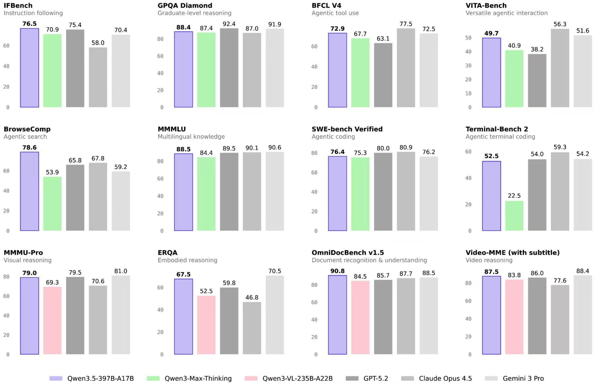
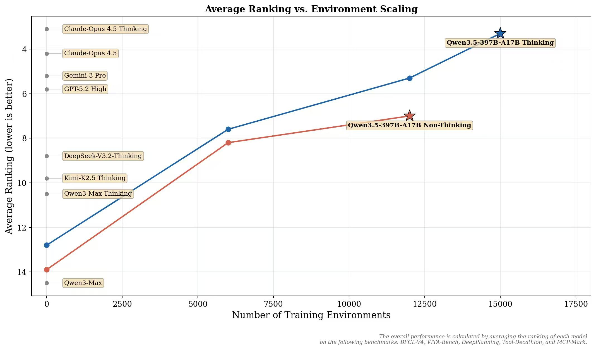
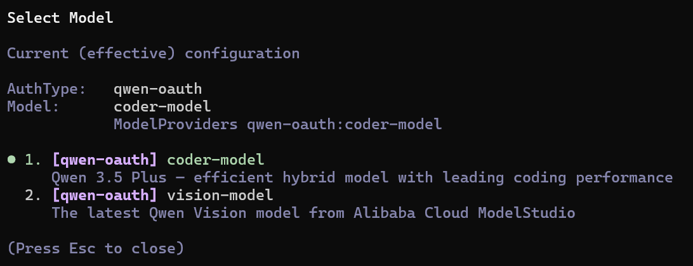

# 🤖 Qwen Code OAuth Plugin for OpenCode

> **改进版** - 在 [opencode-qwencode-auth](https://github.com/gustavodiasdev/opencode-qwencode-auth) 基础上添加了请求节流、429 处理、请求头对齐等增强功能


---

## ✨ 在您的 OpenCode 上使用 Qwen 最新最强的模型 Qwen3.5 Plus!




## 📋 快速开始

### 1. 安装插件

```bash
cd ~/.config/opencode && npm install github:RunMintOn/OpenCode-Qwen-Proxy
```

### 旧版本用户如何最快升级

```bash
cd ~/.config/opencode
npm uninstall opencode-qwen-proxy
npm install github:RunMintOn/OpenCode-Qwen-Proxy
```

安装完成后请完全重启 OpenCode。

如果你需要固定某个版本排查问题，可使用：
`npm install github:RunMintOn/OpenCode-Qwen-Proxy#vX.Y.Z`

### 2. 启用插件

编辑 `~/.config/opencode/opencode.jsonc`：

```json
{
  "plugin": ["opencode-qwen-proxy"]
}
```

### 3. 登录认证

```bash
opencode auth login
```

然后疯狂按住"↓",选择 **"Other"** → 输入 `qwen-code` → 选择 **"Qwen Code (qwen.ai OAuth)"**

浏览器会自动打开，登录 qwen.ai 并授权即可。

---

## ✨ 核心特性

### 基础功能

- 🔐 **OAuth Device Flow** - 基于 RFC 8628 的标准认证流程
- 🆓 **1000 次/天免费** - 无需 API Key，无需信用卡
- 🔄 **自动 Token 刷新** - 过期前自动续期
- 🔗 **凭证共享** - 与 Qwen Code CLI 共享 `~/.qwen/oauth_creds.json`

### 改进功能（本版本独有）

- ⏱️ **请求节流** - 控制 1 秒/次，避免触发 60 次/分钟限制
- 📡 **429 自动重试** - 遇到限流自动等待后重试
- 🎲 **请求抖动** - 0.5-1.5s 随机延迟，避免固定模式
- 🏷️ **请求头对齐** - 与 qwen-code CLI 完全一致的 Headers

---

## 🎯 可用模型

> **重要**：Qwen OAuth 仅支持 2 个模型，与 qwen-code CLI 完全对齐。

| 模型           | 上下文      | 最大输出   | 说明                   |
| -------------- | ----------- | ---------- | ---------------------- |
| `coder-model`  | 1M tokens   | 64K tokens | 代码模型（默认，推荐） |
| `vision-model` | 128K tokens | 32K tokens | 视觉模型               |

### 使用示例

```bash
# 使用代码模型（推荐）
opencode --provider qwen-code --model coder-model

# 使用视觉模型
opencode --provider qwen-code --model vision-model
```

> **注意**：
> **根据qwen code描述,coder-model 模型就是最新发布的qwen 3.5 plus**

---

## 📊 使用限制

| 计划         | 速率限制   | 每日限制   |
| ------------ | ---------- | ---------- |
| Free (OAuth) | 60 次/分钟 | 1000 次/天 |

> 限制于北京时间次日 0 点重置。如需更高限制，可使用 [DashScope API](https://dashscope.aliyun.com)。

---

## ⚙️ 插件工作原理

### 整体流程

```
┌─────────────────────────────────────────────────────────────────┐
│                        用户输入问题                              │
└─────────────────────────────────────────────────────────────────┘
                              │
                              ▼
┌─────────────────────────────────────────────────────────────────┐
│                      OpenCode CLI                                │
│  ┌────────────────────────────────────────────────────────────┐ │
│  │ 加载插件                                                    │ │
│  │   ├─ loader: 返回 apiKey + fetch 函数                       │ │
│  │   └─ methods: 处理 OAuth 认证                               │ │
│  └────────────────────────────────────────────────────────────┘ │
└─────────────────────────────────────────────────────────────────┘
                              │
                              ▼
┌─────────────────────────────────────────────────────────────────┐
│                    插件 fetch 拦截器                              │
│  ┌──────────────────────────────────────────────────────────┐  │
│  │ 1. 添加 Headers                                           │  │
│  │    - User-Agent: QwenCode/0.10.3 (linux; x64)            │  │
│  │    - X-DashScope-CacheControl: enable                    │  │
│  │    - X-DashScope-AuthType: qwen-oauth                    │  │
│  │ 2. 添加 Authorization: Bearer <token>                     │  │
│  │ 3. 请求节流 (1 秒间隔 + 随机抖动)                           │  │
│  │ 4. 429 处理 (等待后重试)                                    │  │
│  └──────────────────────────────────────────────────────────┘  │
└─────────────────────────────────────────────────────────────────┘
                              │
                              ▼
┌─────────────────────────────────────────────────────────────────┐
│                    portal.qwen.ai/v1                             │
└─────────────────────────────────────────────────────────────────┘
```

### 插件的三个角色

| 角色           | 函数      | 作用                                 |
| -------------- | --------- | ------------------------------------ |
| **认证提供者** | `loader`  | 返回配置（apiKey + baseURL + fetch） |
| **请求拦截器** | `fetch`   | 拦截所有请求，添加 Headers + 节流    |
| **OAuth 入口** | `methods` | 处理用户登录，获取 access token      |

---

## 🔬 设计细节

### 1. 请求节流（Throttling）

**问题**：OpenCode 产生请求比 Qwen Code CLI 多，容易触发 60 次/分钟限制。

**解决**：请求队列控制速率。

```typescript
class RequestQueue {
  private lastRequestTime = 0;
  private readonly MIN_INTERVAL = 1000; // 1 秒

  async enqueue<T>(fn: () => Promise<T>): Promise<T> {
    const elapsed = Date.now() - this.lastRequestTime;
    const waitTime = Math.max(0, this.MIN_INTERVAL - elapsed);

    if (waitTime > 0) {
      await new Promise((resolve) => setTimeout(resolve, waitTime));
    }

    this.lastRequestTime = Date.now();
    return fn();
  }
}
```

**效果**：确保每次请求间隔 ≥ 1 秒，不会超过 60 次/分钟。

---

### 2. 请求抖动（Jitter）

**问题**：固定间隔的请求模式可能被识别为"非正常用户"。

**解决**：在 1 秒基础上添加 0.5-1.5s 随机延迟。

```typescript
// src/plugin/request-queue.ts
private readonly JITTER_MIN = 500;
private readonly JITTER_MAX = 1500;

private getJitter(): number {
  return Math.random() * (this.JITTER_MAX - this.JITTER_MIN) + this.JITTER_MIN;
}
```

**效果**：请求间隔 = 1 秒 + (0.5~1.5s 随机) = 1.5-2.5s 随机，更像真实用户行为。

---

### 3. 请求头对齐（Header Alignment）

**问题**：服务器可能通过 Headers 识别客户端来源。

**解决**：模拟 qwen-code CLI 的 Headers。

```typescript
headers.set("User-Agent", `QwenCode/0.10.3 (${platform}; ${arch})`);
headers.set("X-DashScope-CacheControl", "enable");
headers.set("X-DashScope-UserAgent", `QwenCode/0.10.3 (${platform}; ${arch})`);
headers.set("X-DashScope-AuthType", "qwen-oauth");
```

**效果**：从 Headers 看，请求与 qwen-code CLI 无法区分。

---

### 4. 429 错误处理

**问题**：即使节流，仍可能偶尔触发限流。

**解决**：自动等待后重试。

```typescript
if (response.status === 429) {
  const retryAfter = response.headers.get("Retry-After") || "60";
  await sleep(parseInt(retryAfter) * 1000);
  return fetch(input, { headers }); // 重试
}
```

**效果**：遇到限流自动恢复，无需用户干预。

---

## ✨ 改进功能

| 功能            | 说明                                                                |
| --------------- | ------------------------------------------------------------------- |
| ⏱️ 请求节流     | 1 秒间隔 + 0.5-1.5s 随机抖动，避免触发 60 次/分钟限制               |
| 📡 429 自动重试 | 遇到限流自动等待后重试                                              |
| 🏷️ 请求头对齐   | User-Agent、X-DashScope-\* 与 qwen-code CLI 完全一致                |
| 💾 Token 缓存   | 5 分钟内不重复刷新，减少额外请求                                    |
| 🎯 模型精简     | 仅支持 2 个模型（coder-model、vision-model），与 qwen-code CLI 对齐 |

---

## 🔧 故障排查

### Token 过期

插件会自动刷新 Token。如仍有问题：

```bash
# 删除旧凭证
rm ~/.qwen/oauth_creds.json

# 重新认证
opencode auth login
```

### 429 错误频繁

- 检查是否同时运行多个 OpenCode 实例
- 等待配额重置（北京时间 0 点）

### 插件不显示

在 `opencode auth login` 中：

1. 选择 **"Other"**
2. 输入 `qwen-code`

---

## 🛠️ 本地开发

### 方法一：使用 npm link（推荐）

**步骤 1：克隆项目**

```bash
git clone https://github.com/RunMintOn/OpenCode-Qwen-Proxy.git
cd OpenCode-Qwen-Proxy
```

**步骤 2：安装依赖**

```bash
npm install
```

**步骤 3：链接插件**

```bash
# 在插件项目目录下执行 link
npm link
```

**步骤 4：在 OpenCode 中配置**

```bash
# 进入 OpenCode 配置目录
cd ~/.config/opencode

# 如果已有 package.json，直接添加依赖
npm install opencode-qwen-proxy --save

# 如果没有 package.json，先初始化
npm init -y
npm install opencode-qwen-proxy --save
```

**步骤 5：验证插件加载**

```bash
# 重启 OpenCode 或开始新对话
opencode --version
```

---

### 方法二：使用 file: 协议（适用于需要指定特定版本）

**步骤 1-3：同上**

```bash
# 克隆项目并安装依赖
git clone https://github.com/RunMintOn/OpenCode-Qwen-Proxy.git
cd OpenCode-Qwen-Proxy
npm install
```

**步骤 4：先构建插件**

```bash
# 构建插件（必须先构建）
npm run build
```

> 注意：`file:` 协议需要指向包含 `package.json` 的目录，所以必须先执行构建。

**步骤 5：配置本地链接**

编辑 `~/.config/opencode/package.json`：

```json
{
  "dependencies": {
    "opencode-qwen-proxy": "file:/path/to/OpenCode-Qwen-Proxy"
  }
}
```

> 将 `/path/to/OpenCode-Qwen-Proxy` 替换为实际的绝对路径，例如：
>
> - Linux/Mac: `file:/home/username/OpenCode-Qwen-Proxy`
> - Windows: `file:C:/Users/username/OpenCode-Qwen-Proxy`

**步骤 6：安装依赖**

```bash
cd ~/.config/opencode && npm install
```

---

### 开发模式（推荐）

开发过程中可以使用 watch 模式，自动重新加载：

```bash
# 在插件项目目录下
npm run dev
```

这样修改代码后会自动重新构建，方便实时调试。

---

### 构建命令说明

| 命令                | 说明                               |
| ------------------- | ---------------------------------- |
| `npm run build`     | 构建生产版本到 `dist/` 目录        |
| `npm run dev`       | 开发模式，监听文件变化自动重新构建 |
| `npm run typecheck` | TypeScript 类型检查                |

---

### 调试技巧

**1. 启用调试日志**

```bash
# 临时启用调试日志
OPENCODE_QWEN_DEBUG=1 opencode ...
```

**2. 查看插件日志**

插件运行时会输出调试信息（如果启用了调试模式），可以帮助排查问题。

**3. 检查凭证**

```bash
# 查看凭证文件位置
cat ~/.qwen/oauth_creds.json
```

---

### 常见问题

**Q：修改代码后需要重新 install 吗？**

> A：使用 `npm link` 不需要；使用 `file:` 协议每次修改代码后需要重新 `npm install`（或者用 `npm run dev` 自动构建后重启 OpenCode）。

**Q：如何确认插件已加载？**

> A：在 OpenCode 中执行 `opencode auth login`，如果能看到 "Qwen Code (qwen.ai OAuth)" 选项，说明插件已正确加载。

**Q：遇到问题怎么办？**

> A：
>
> 1. 确认 `~/.config/opencode/opencode.jsonc` 中已添加 `"plugin": ["opencode-qwen-proxy"]`
> 2. 运行 `npm run typecheck` 检查代码是否有语法错误
> 3. 查看控制台输出是否有错误信息

---

## 📁 项目结构

```
opencode-qwen-proxy/
├── src/
│   ├── index.ts              # 插件入口（loader + fetch + methods）
│   ├── constants.ts          # OAuth 端点、模型配置
│   ├── types.ts              # TypeScript 类型
│   ├── qwen/
│   │   └── oauth.ts          # OAuth Device Flow + PKCE
│   └── plugin/
│       ├── request-queue.ts  # 请求队列 + 节流
│       └── auth.ts           # 凭证管理
├── package.json
└── README.md
```

---

## 🔗 相关项目

- **[opencode-qwencode-auth](https://github.com/gustavodiasdev/opencode-qwencode-auth)** - 本项目基于此插件改进
- [qwen-code](https://github.com/QwenLM/qwen-code) - 官方 Qwen Code CLI
- [OpenCode](https://opencode.ai) - AI 编程助手 CLI
- [opencode-antigravity-auth](https://github.com/NoeFabris/opencode-antigravity-auth) - Google OAuth 参考实现

---

## 📄 许可证

MIT

---

<p align="center">
  基于 <a href="https://github.com/gustavodiasdev/opencode-qwencode-auth">opencode-qwencode-auth</a> 改进
</p>
